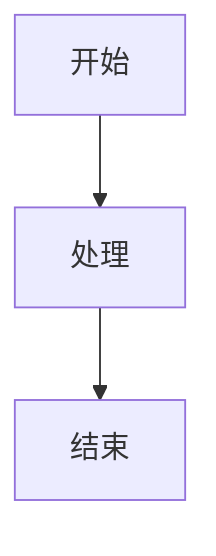

+++
date = '2026-02-11T19:51:27+08:00'
draft = true
title = '02'
+++


# 标题

## 支持的扩展

- CJK 支持（中日韩文字）
- 定义列表
- 脚注[^1]
- ~~删除线~~
- 表格
- 任务列表
- 排版功能

[^1]: 这是脚注内容

## 定义列表示例

苹果
: 一种水果

橙子
: 另一种水果

## 表格示例

| 功能 | 支持 | 备注 |
|------|------|------|
| 基本 Markdown | ✅ | 完全支持 |
| 扩展语法 | ✅ | 部分支持 |

## 任务列表

- [x] 已完成任务
- [ ] 未完成任务


```
行内公式：$E = mc^2$

块级公式：
$$\sum_{i=1}^{n} x_i = x_1 + x_2 + \cdots + x_n$$
```


maermaid
<!-- Mermaid 示例 -->



{width=1920 height=6178}